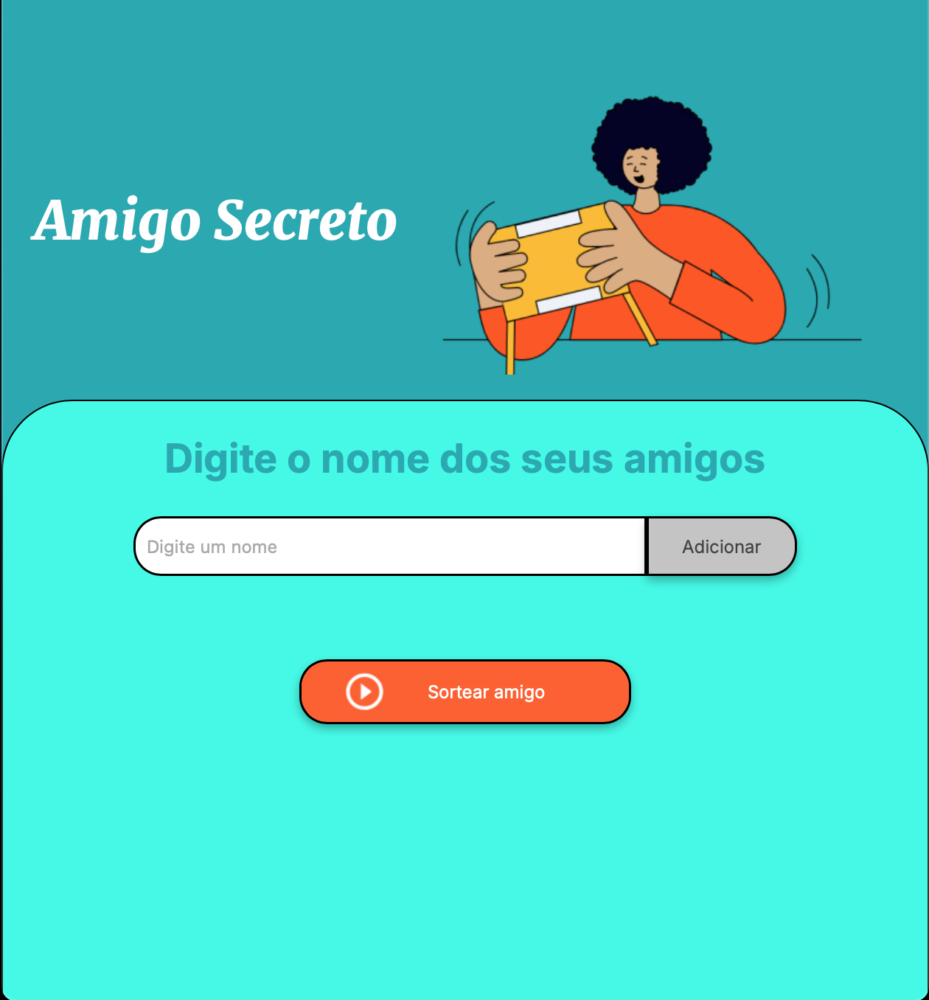

# Challenge Amigo Secreto

## Projeto para sortear amigo secreto

Este projeto é uma aplicação web simples para sortear amigo secreto entre um grupo de amigos. Os usuários podem adicionar nomes e sortear aleatoriamente um amigo secreto.

## Estrutura do Projeto

- `index.html`: Arquivo principal da aplicação contendo a estrutura HTML.
- `app.js`: Arquivo JavaScript contendo a lógica para adicionar amigos e sortear o amigo secreto.
- `style.css`: Arquivo CSS para estilização da aplicação.
- `assets/`: Pasta contendo imagens e outros recursos estáticos.
- `README.md`: Este arquivo.

## Como Usar

1. Abra a pagina clicando no link [Challenge Amigo Secreto](https://dericksoares88.github.io/challenge-AmigoSecreto-ONE/)
2. Digite o nome dos seus amigos no campo de entrada e clique no botão "Adicionar".
3. Após adicionar todos os nomes, clique no botão "Sortear amigo" para realizar o sorteio.

## Tecnologias Utilizadas

- HTML
- CSS
- JavaScript
